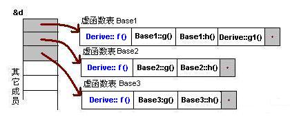

# C++一些细节与总结

## 变量和基本类型

### 左值和右值

左值(lvalue)代表一个在内存中占有确定位置的对象（也就是有一个地址），反之则为右值

### 变量存储

global data, local, 和 dynamically allocated 分别存在不同的地方

static 修饰的变量和global data 存放在一个区域，所以即使函数结束也不会消失

程序在内存中一般分为4个区域：

- 代码区
- 全局变量区：静态数据和全局数据
- 栈区：函数内部的自动变量，随函数的退出而释放空间
- 堆区：由new产生的动态数据，需要手动释放空间

### static 和 extern类型

extern 只是一个声明（需要写出类型），表示接下来函数会用到这个类型的这个变量，在编译阶段能顺利通过，在链接的时候去别的函数寻找对应的变量（只有global 的变量才能找到）

static 修饰的变量/函数只能在这个cpp文件中被找到，在链接的时候会屏蔽其他文件，extern搜索不到

### new 和 delete

C++里普遍用new 和 delete 代替malloc 和 free

new 比 free 强的地方在于malloc只分配了这一块空间，但new能同时进行初始化

```C++
new typename(init); //开辟一个typename空间并赋初值init
new typename[number]; //开辟一个大小为number的typename的数组
delete typename;
delete [] typename;
```

**delete后指针仍然指向地址，但是没有引用的权限** （事实上delete后再次调用的不合法的）

不能连续delete同一个变量两次（可以编译，但是运行的时候会出错）

可以对nullptr进行delete（无事发生）

new 和 delete数组的时候相当于连续new/delete多次，如果delete不加[]那么只会调用一次 

### 指针和引用

引用本身不是对象，不能定义指向引用的指针；但是指针是对象，存在对指针的引用

**C++ Primer上说因为引用本身不是对象，所以不能定义引用的引用；但是实测好像可以诶，但是最好别用，因为有可能是bug** 

**理解一个变量的类型到底是什么，应该从右往左读它的定义，离变量名最近的符号对它的类型有最直接的影响**

```C++
const int *const t = &p//离pip最近的const说明p是一个const，下一个符号*说明是一个常量指针，最后const int说明它指向一个int类   					   型的常量
```

```C++
int (*Parray)[10] = &arr; //Parray指向一个含有10个整数的数组
int (&arrRef)[10] = arr; //arrRef指向一个含有10个整数的数组
int *(&arry)[10] = ptrs; //arry是数组的引用，该数组含有1个指针
```

**先关注括号里面的表达式，再从右往左看**

### const 和 constexpr

const 对象仅在文件内有效，但是可以添加extern来使其他文件访问

允许一个常量引用绑定非常量的对象，字面值，但是绑定之后非常量也不能修改

函数与const

- 函数名前加const表示返回值为const类型
- 函数名后加const表示不可以修改class的成员

```C++
int main()
{
	int c = 10;
    const int &r = c;
    c = 14; //error: assignment of read-only reference 'r'
}
```

`const_cast <type_id> (expression)` 用于将const转成非const（也可以将非const转成const，但是很少这样用）

temporary values是const

```C++
void f(int &a);
f(i * 3); //Error!
//What the compiler generates
const int _temp_ = i * 3;
f(_temp_); //Problem -- binding non-const ref to const argument!
```

### 处理类型

类型别名不是类似宏的单纯文本替换

```C++
typedef char *p; 
const p pstr; //声明一个指向char的常量指针
const char *pstr; //声明一个指向const char的指针
```

### 预处理

- #ifndef和#ifdef都是执行到#endif结束
- 最好在变量声明的头文件里无脑加上#ifndef和#endif

### 运算符

```C++
int a = 3, b = 4;
cout << a / b * 1.0; //错，结果可能为0，也可能为0.75，具体的运算顺序未知
cout << (a * 1.0) / b; //对，括号里优先计算
```

### size_t和size_type

- 感觉基本类型用sizeof()得到的是size_t类型，容器类型用size_type得到的是size_type类型

+++

## 类

**类的大小**：只算变量大小和虚函数指针大小，构造函数成员函数不计算在内

**引用可以作为成员，并且不需要初始值，但是必须在初始化列表里进行初始化**

**友元函数的作用是实现了类之间的数据共享，减少系统开销，提高效率；缺点是破坏了类的封装特性**

**友元类：**所有成员函数都是另一个类的友元函数，都可以访问另一个类中的隐藏信息

- 友元关系不能继承
- 友元关系是单向的，不具有交换性
- 友元关系不具有传递性

**private里是不能直接访问的，通过public里的函数进行初始化或其他操作**

- 用friend进行友元声明的函数可以访问private里的属性，但是class里的friend仅声明了访问权限，如果想使用函数还需在外部进行声明

- 但其实在main里用指针照样能改private的值，因为这些毕竟是通过二进制数存储的，只要通过指针找到地址就能修改所有的值

- 所谓的不能直接访问指的是类外结构不能直接访问，但是类内结构还是可以直接访问

- protected对于inheritance和friend来说是public，对于其他外部class是private

  

**关注一下constructor和destructor**

**C++的class和C的struct区别不大，最主要的区别就是C++可以将methods封装到类的内部，同时对于内部成员有public和private区别**

```C++
struct A{
	int n;
};

struct B{
	int m;
};
A a;
a.n = 1; //错误，class默认private
B b;
b.m = 1; //正确：struct默认public
```

**`.field`指的是在class外定义的class的函数**

```C++
//<class name>::<function name>>
//::<function name>>
void S::f()
{
	::f(); //would be recursive otherwise
	::a++; //select the global 'a'
	a--; //the 'a' at class scope	
    //.field的本地变量优先于class变量
}
```

**this**：对象通过this指针访问自己的地址，是所有成员函数的隐藏参数

- 友元函数没有this指针
- 只能用于成员函数，不能用于被static修饰的函数（静态函数）

**静态成员函数和静态成员变量**：都可以通过`<类名>::`的方式调用，描述的是类整体的性质

- 静态成员变量
  - 不能在initializer list中输出化，也不能在构造函数中初始化，需要在类的定义之外单独初始化（类似全局变量）
  
  - **在类之外`int Base::i = 0`才是真正的定义，类中任何关于i的只是使用变量（所以会报错）**
  
    ```C++
    class Base{
    	private:
    		static int i; //可以理解为一个声明，存在这样一个静态数据变量，但并不是定义
    		...
    };
    int Base::i = 0; //真正的定义和初始化
    ```
  
  - 是所有对象公有的，存储在全局变量区域（解决数据共享问题）
- 静态成员函数
  
  - 没有this指针，故无法直接访问非静态数据成员和函数，但是可以直接访问其他静态成员和函数

**Initializer list**: can initialize any type of data

- order is the order of declaration, not the order in the initializer list
- destroyed in the reverse order
- 静态成员变量不能用initializer list初始化，因为它是整个类公有的

```C++
Student::Student(string s) : name(s) {} //initialization, before constructor body
Student::Student(string s) {name = s;} //assignment, inside constructor body, require a default constructor
```

**Inheritance**:

- 基类永远是先construct
- 如果在派生类中重定义了成员函数，那么基类中的成员函数无法直接访问（虚函数另外讨论）
- **基类的私有成员派生类中继承但是无法直接访问，只能通过基类的成员函数访问**

```C++
class Base{
    private:
        int k;
    public:
        Base(int i) : k(i) {}
        void print(void) {cout << k << endl;}
}
class Derived : public Base{
    private:
        int j;
    public: 
        Derived(int a, int b) : Base(a), j(b) {}
        void print(void) {cout << j + 1 << endl;} //无法打印k，因为无法访问
}
int main()
{
    Derived a(1, 2);
    a.print(); //3
    a.Base::print(); //1
}
```

**up-casting**: convert from derived reference or point to a base reference or point

- 等价于一个Base对象，不能使用Derived成员函数，包括重载函数
- 引用有点类似指针，传参数的时候可以避免up-casting

```c++
class shape{
public:
	void render() {cout << "Shape::render()" << endl;}
};
class circle : public shape{
public：
	void render() {cout << "Circle::render()" << endl;}
};
void foo(shape s)
{
	s.render();
}
void bar(shape& s)
{
    s.render();
}
int main()
{
	circle c; 
	c.render(); //Circle::render()
	bar(c); //如果render前不加virtual, 那么输出的是Shape; 如果render前加virtual, 那么输出Circle
	foo(c); //Shape::render(), circle up-casting to shape
    //因为前一行是对象c调用render，后一行是shape的对象s调用render
    //如果想输出Circle需要用虚函数，并且传入指针（否则还是shape对象s）
}
```

**拷贝构造**：由copy constructer实现，如果没写编译器会自动生成

- 对于指针的拷贝构造会是共享而不是复制

  

- **拷贝构造不是assignment**

```C++
#include <iostream>
#include <cstring>
using namespace std;

struct Person{
	Person(const char * s) {cout << "Person const char * s" << endl;}
	Person(const Person & other) {cout << "Person const Person & other" << endl;}
};

Person foo(Person p)
{
	cout << "in foo()" << endl;
	return p;
}

Person bar(const char * s)
{
	cout << "in bar()" << endl;
	return Person(s);
}

int main()
{
	Person p1 = foo("Trump");
	cout << "--------------------------" << endl;
	Person p2 = bar("Obama");
}
/*在拷贝构造的时候，编译器会自动优化，如直接编译会出现如下结果：
 *Person const char * s 构造p
 *in foo()
 *Person const Person & other p拷贝给p1
 *--------------------------
 *in bar()
 *Person const char * s 直接构造p2
 *加上参数-fno-elide-constructors取消优化，得到如下结果：
 *Person const char * s 构造t1
 *Person const Person & other t1拷贝给p
 *in foo()
 *Person const Person & other p拷贝给t2
 *Person const Person & other t2拷贝给p1
 *--------------------------
 *in bar()
 *Person const char * s 构造t3
 *Person const Person & other 拷贝给t4
 *Person const Person & other 拷贝给p2
 */
```

**静态成员函数**：没有`this`指针，只能访问静态成员变量，但是可以直接通过`类名::fun`调用

**运算符重载**：只有已经存在的运算符才能重载

- 两个基本要求：
  - 操作数的数量不变
  - 运算符的优先级不变
- **`= () [] -> ->*` 必须是成员函数** 
  - 一般单目运算符为成员函数，双目运算符为友元函数
  - `:: sizeof . .* ?:`等不能重载
- 作为成员函数：无 type conversion
- 作为global函数：
  - 所有参数都可以 type conversion
  - 可以成为friend

```C++
//member function
x = y + z //Success!
x = y + 3 //Error! No type conversion
//global function
x = y + 3 //Success!
```

- 必须作为成员函数的运算符：一元运算符，`=, (), ->, ->* []`
- 区分前缀++和后缀++：
  - 后缀需要一个参数int——编译器会自动pass 0，前缀不需要
  - 自定义的前缀比后缀more efficient

```C++
class Integer{
	public:
		Integer& operator++(); //prefix++
		Integer& operator++(int); //postfix++
};
Ingeter& Integer::operator++()
{
	*this += 1; //increment
	return *this; //fetch
}
Integer& Integer::operator++(int)
{
	Ingeter old(*this); //fetch
	++(*this); //increment
	return old; //return
}
```

- 关系运算符
  - 用==构建!=
  - 用`<`构建`>, >=, <=`
- 下标运算符[]
  - 必须以成员函数的形式进行重载
  - 返回类型必须是引用（返回本身）
- 赋值运算符=
  - 必须是成员函数
  - 如果没有显式指明，编译器会自动构造
  - 为了防止编译器生成默认函数，可以将其定义为explicit或使用=delete

```C++
Int& operator=(Int& b) = delete;
```

- 自定义类型转换
  - 编译器使用隐式类型转换操作符
  - 编译器通过`single-argument constrctor`进行类型转换（可以通过explicit取消）`explicit Name(const &string);`
  - 可以将一种类转换成另一种类或内置类型
- 类型转换符：`X::operator T()`
  - T是任意类型名
  - 没有显式参数
  - 没有返回类型(但是有return)
  - 转换`X -> T`
- 类型转换时如果存在两条相互转换路径，会产生ambiguous， 应该给编译器指明转换路径

```C++
class Rational{
	public:
		operator double() const
		{
			return numerator / (double) denominator;
		}
};
Rational r(1, 3);
double d = 1.3 * r; //r -> double
```

+++

## 泛型容器

**模板**：`template <class T> \ template <typename T>`

- 函数模板：把函数内所有相关类型名都换成T，在编译的时候会根据实际的变量类型创建函数

  - 如果实际有m个不同类型需要用到该模板函数，则实际会创建m个不同函数（m>=0）

  - 禁止类型转换（包括显式和隐式）

    ```C++
    swap(int, int); //ok
    swap(double, double); //ok
    swap(int, double); //error!
    ```

  - 模板函数和普通函数可以同时存在

    - 先check普通函数
    - 再check相应模板函数
    - 最后在普通函数上进行隐式转换

    ```C++
    void f(float, float);
    template <class T>
    void f(T, T);
    f(1.0, 2.0); //check unique function
    f(1, 2); //check template function
    f(1, 2.0); //implicit conversion on unique function
    ```

  - 显式实例化：`foo<real type name> (a, b)`

- 类型模板

  - 典型用法：各种容器`stack, queue, list`等，如`list <int>`

  - 模板class中成员函数的写法

    ```C++
    T& Vector<T>::New(int size)
    {
    	m = new T[size];
    	...
    }
    ```

- 模板

  - 允许嵌套，成为一个新类型：`Vector< Vector<double> >`

  - 类型参数可以很复杂`Vector< int (*) (Vector<double>&, int) >`

  - 无类型参数：能使代码更快，但是代码更复杂，肿胀

    ``` C++
    template <class T, int bound = 100>
    class FixedVector
    {
    	T dada[bound]; //fixed-size array
    }
    FixedVector <int 50> v1;
    FixedVector <int> v1; //use default
    ```


**STL:** Standard Template Library

- three parts of STL: Containers, Algorithms, Iterators
- 可以用typedef简化长定义：`typedef map<string, map<int, int>> PB; PB::iterator it;`
  - 也可以直接用`auto`
- 在容器中使用自定义类的时候，需要写`assignment operator: operator=()`和构造函数
  - 对于需要排序的容器，还需要写`less than operator: operator<()`
- map不能用`foo["Bob"] == 1`来判断是否存在，因为若不存在map会自动生成`foo["Bob"]`
  - 可以用`foo.count("Bob")`来判断
- 不同的容器底层实现不同，如vector是用数组实现，list是用双向链表实现，set是用红黑树实现
  - 容器的实际存储和输入未必一致，如set在输入后会自动排序（中序遍历）
  - 有的容器不能用下标访问，如list用链表实现，应用迭代器实现

### Vector

- vector 和 string在某种程度上很像，初始化、比较大小等都差不多

```c++
#include <vector>
#include <string>
vector<int> v1(10, 1); //v1有10个元素，每个的值都是1
vector<int> v2{10, 1}; //v2有2个元素，分别为10，1
vector<string> v3{"Hi"}; //列表初始化：v3有一个元素
vector<string> v4("Hi"); //错误：不能用字符串字面值构建vector
vector<string> v5{10, "Hi"}; //v5有10个值为"Hi"的元素
vector<string> v6{10}; //v6有10个默认初始化元素
```

- 初始化可以理解为在内存中拷贝已有地址内容，而字符串字面值相当于没有地址，所以不能用于直接初始化

- 遇到{ }会首先寻求列表初始化，如v2；但是v5的10与string类型不匹配，再寻求其他初始化方式，采用默认值初始化

- 在使用vector时除非所有值都一样，否则先定义空vector再添加为更优解

- vector下标访问不做检查，`vector[100]`只有在运行的时候才会报错

- vector在分配地址: 

  1. 开始为空地址，capacity = 0
  2. 插入第一个数，现有capacity不够，capacity += 1
  3. 插入第二个数，现有capacity不够，new一个新block，其capacity *= 2，将原block的数据拷贝进新block（此时需要拷贝构造）    	
  4. 插入第三个数，重复步骤3，此时capacity = 4，size = 3，block中有一个空位置

```C++
struct Point{
	int x, y;
	Point (int x, int y) : x(x), y(y) {cout << "Point(int, int)" << endl;}
	Point (const Point& p) : x(p.x), y(p.y) {cout << "copy ctor" << endl;}
};
ostream& operator<<(ostream& out, const Point& p)
{
	return out << "(" << p.x << ", " << p.y << ")";
}
int main()
{
	vector<Point> pts;
	pts.push_back(Point(1,2)); //传入参数的时候本身会调用一次拷贝构造
	cout << "capacity: " << pts.capacity() << ", size: " << pts.size() << endl;
	pts.push_back(Point(3,4));
	cout << "capacity: " << pts.capacity() << ", size: " << pts.size() << endl;
	pts.push_back(Point(5,6));
	cout << "capacity: " << pts.capacity() << ", size: " << pts.size();
}
/*Point(int, int)
 *copy ctor
 *capacity: 1, size: 1
 *Point(int, int)
 *copy ctor
 *copy ctor
 *capacity: 2, size: 2
 *Point(int, int)
 *copy ctor
 *copy ctor
 *copy ctor
 *capacity: 4, size: 3
 */
```

### 迭代器

```C++
for (auto it = s.begin(); it != s.end(); ++it)
	*it = toupper(*it);
```

- 所有标准库容器的迭代器都定义了\==和!=，但是他们大多都没有定义<（==比如set就没有==），所以在C++中常常用!=；同理所有标准库容器都定义了迭代器，但是大部分都不能用下标，所以在C++中一般使用迭代器
- 使用了循环的迭代体，都不能在循环中改变添加元素
- 尾后指针不能解引用和递增，只是起到一个指示结束的作用
- 所有容器的迭代器都能用`it++`实现遍历，但是对于`list`等不能用下标访问的容器，不能`it += 2`，但是`vector`可以实现

+++

## 输入输出流

```C++
#include <iostream>
using namespace std;

int main()
{
	int a, b;
	cin >> a >> b; // cin是>>可以理解为从输入端 >> 变量a, b
	cout << a + b << endl; //cout是<<可以理解为从变量a, b到输出端，即cout << a + b;
}
```

**不同stream的命名**：


**对于内置类型不需要overload，但是对于自定义类型需要overload**：但是不能是成员函数！

```C++
istream& operator>>(istream& is, T& obj)
{
	//specific code to read obj
	return is; //for chaining: cin >> a >> b >> c
    // << 同理
}
```

**flush()**：强制输出output stream里的内容 （`endl`就是强制输出output stream里的内容并加输出回车）

+++

## 函数

- 函数重载：函数名字相同但是参数个数/类型不同
  - 不允许两个函数只有返回类型不同
  - const和非const看作相同
  
- 函数的默认值：在声明或定义的时候给形参赋默认值

  - 声明指定默认值后，定义不能重复指定默认值（指的是同一个参数）
  - 默认值的定义应从右到左，函数调用时形参按从左到右分配
  - 重载函数中如果如果形参带有默认值会产生二义性

- 调试帮助：`assert（condition);` 
  - 后面没有继续打印的内容
  - #define NDEBUG可以停止调试，但是要放在include前面（==include只是无情的文本替换==)
  
- 内联函数（inlet function)
  
  - 类似于宏，在函数的位置直接展开而非调用
  
  - 内联函数只是一个声明而非定义
  
  - 内联函数的“定义”应该放在头文件里
  
  - `inline`必须和函数定义体放在一起才能成为内联，与函数声明放在一起不起任何作用（为了显式说明也可以放，但不起作用）
  
    ```C++
    inline void Foo(int x, int y);   // inline 仅与函数声明放在一起  
    void Foo(int x, int y) {...}
    // ...
    void Foo(int x, int y);  
    inline void Foo(int x, int y) {...}  // inline 与函数定义体放在一起
    ```
  
  - **定义在类声明中的成员函数自动成为内联函数**
  
  - **`inline`函数是否真正成为`inline`还要看编译器的权衡**
  
  - `inline`函数可以重定义，现在`inline`的用法更多的是表示该函数可以多次定义
  
- 匿名函数：`[capture](parameters)->return-type{body}`

  - `capture`: 捕获外部变量，在匿名函数内不能直接使用外部变量
  - `return-type`: 可选参数，如果不写就根据`body`自动推导

  ```C++
  [a](int x){ return x * a;} //省略了return-type，a是外部变量需要用[]捕捉
  ```

+++

## 多态

### 虚函数

- virtural定义了多态：在基类的函数前加virtual关键字，在派生类重写该函数，运行时会根据对象的实际类型来调用相应的函数，如果 对象是派生类就调用派生类的函数，如果是基类就调用基类的函数，与指针的类型无关，而是与指针实际指向的对象有关。

- 纯虚函数：`virtual void bar0() = 0;` 0表示纯虚函数，带有纯虚函数的class不能直接定义变量，但是可以定义继承的变量

- 虚函数是通过虚函数表实现的，里面存储的是虚函数的地址，并且虚函数表存储在对象实例的最前面（方便提高查询速度），通过遍历函数指针调用函数


- 一般继承

  - 无虚函数覆盖

    - 父类虚函数放在子类虚函数前

       

    

  - 有虚函数覆盖

    - 覆盖的函数放在原来父类虚函数的位置

    - 没有覆盖的函数不动

      

- 多重继承

  - 无虚函数覆盖

    

  - 有虚函数覆盖

    - 每个类的虚函数表中覆盖的函数放在原来父类虚函数的位置

    - 没有覆盖的函数不动

      

- 构造不可以是虚函数,析构函数也需要是虚函数

- 在派生类中可以通过override重写基类中的函数（**一定要把所有重载的该函数都override，否则可能出bug**)

  - override的作用应该是强制重写函数，避免遗忘（除此之外应该没有别的用途）

- 如果想返回类型从基类变成派生类需要把函数写成指针或引用