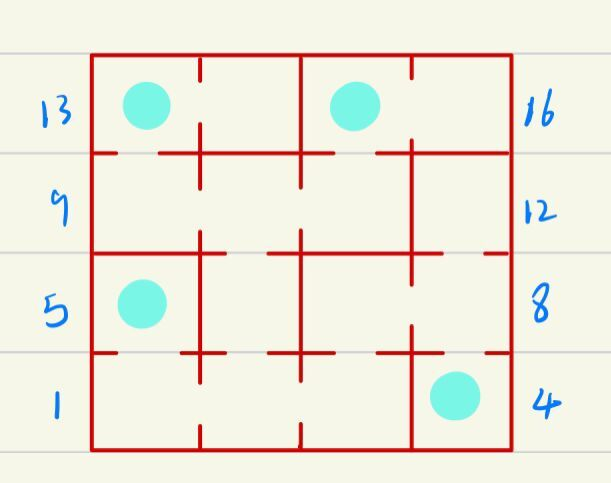
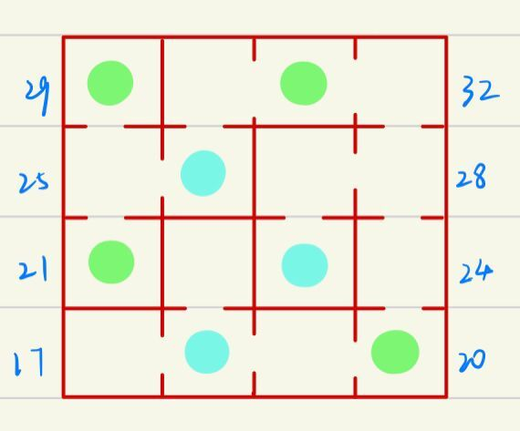
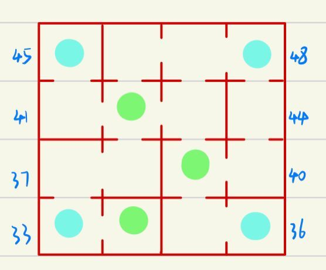
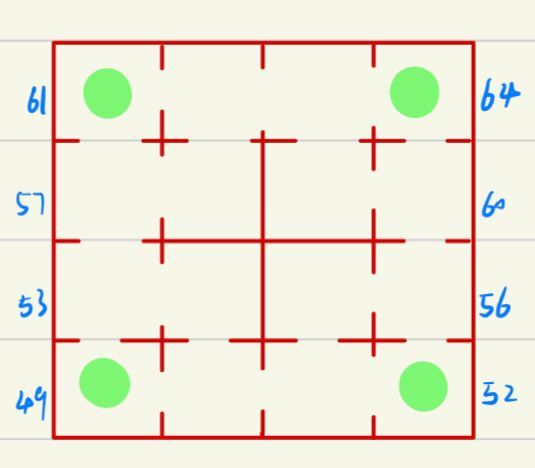

Adventure

 宗亦铭 3200102313

In this homework, I construct a castle with 4 floors, each of which has 16 rooms(4×4). The concrete map of the castle is appended at the  end of this document. And each room is numbered from 1 to 64 as shown in the map.

Locations of the princess and the moster are randomly generated. But for your convinence to check my code, I set the fixed locations of the princess and the moster. Meanwhile, I offer two test inputs, one for meeting princess and one for meeting monster. To play the random-location version, you can change locations in Line 56 and 57, replacing 42 with i and replecing 30 with k.

Here is the map (Blue points represent upstairs and green points represent downstairs):  

- ground floor

- first floor

- second floor

- third floor

